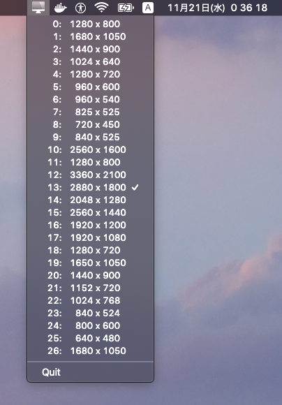

# DisplayModeSwitcher

Tiny statusbar utility for switching resolutions(display-mode) on macos



## Howto

A. This is a single swift script with shebang:

```sh
$ ./DisplayModeSwitcher.swift &
```

B. Run a compiled binary with swiftc:

```sh
$ swiftc DisplayModeSwitcher.swift
$ ./DisplayModeSwitcher &
```

C. Build app bundle and dmg acrchive with script:

```sh
$ ./makeappbundle.sh
$ open DisplayModeSwitcher.app
```

To launch from Launchpad, copy it into `~/Apllications/` as:

```sh
$ cp -a DisplayModeSwitcher.app ~/Applications/
```


## License

- https://opensource.org/licenses/isc-license.txt

